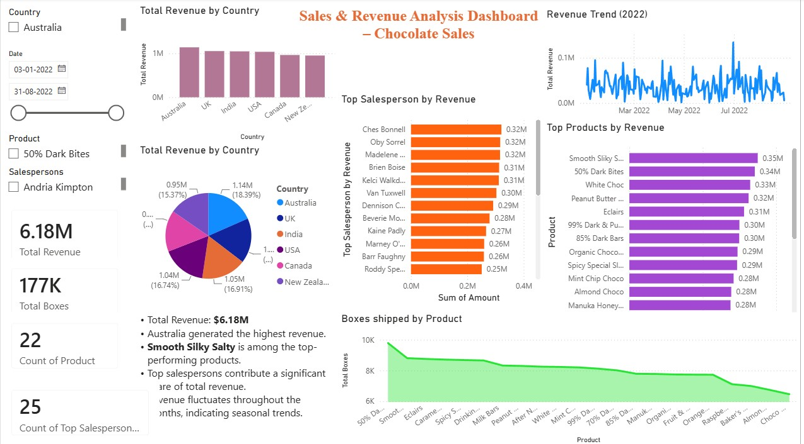

# 📊 Sales & Revenue Analysis Dashboard

## Dashboard Preview

---

## Project Overview

This project presents an interactive Sales & Revenue Analysis Dashboard developed in Microsoft Power BI using a Chocolate Sales dataset. The dashboard enables users to monitor business performance through KPIs, revenue trends, product performance, and country-wise sales analysis.

## Features

- 📈 Total Revenue KPI
- 📦 Total Boxes Sold
- 🍫 Top Performing Products
- 🌍 Revenue by Country
- 👤 Top Salespersons
- 📅 Monthly Revenue Trend
- 🎛️ Interactive Filters & Slicers

## Tools Used

- Microsoft Power BI
- Microsoft Excel / CSV
- GitHub

## Files Included

- Sales and revenue.pbix
- Chocolate Sales.csv
- Sales and revenue.pdf

## Business Insights

- Total Revenue: **6.18M**
- Australia generated the highest revenue.
- Smooth Silky Salty is among the top-performing products.
- Revenue shows seasonal fluctuations.
- Top salespersons contribute significantly to overall revenue.

## Skills Demonstrated

- Data Visualization
- Business Intelligence
- Dashboard Design
- KPI Tracking
- Sales Analytics
- Data Analysis

## Author

**Shalini K C**
